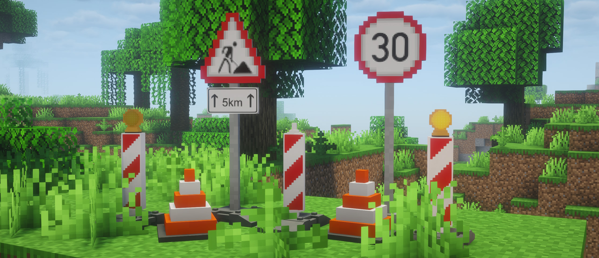
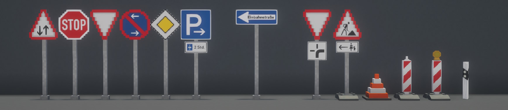
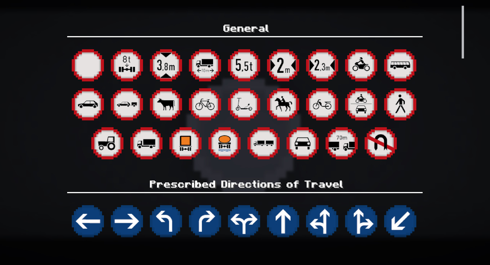
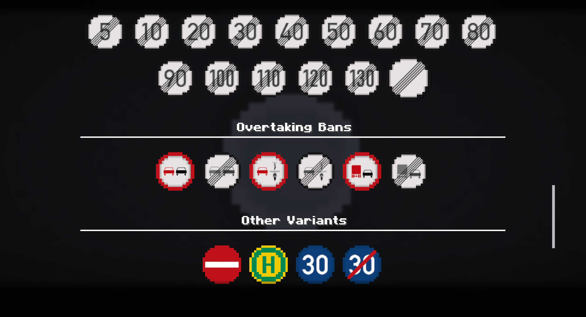

# Roadside Addons


Fabric Mod for 1.21.1 adding Minecraft Style Traffic Signs, Cones and more!


## New Blocks


Adds Sign Poles and 9 different *European* (*German*) Street Sign Blocks as well as blocks for construction sites and "bollards".

## Sign Variant Selection

<div style="text-align: center;">
 
</div>

Use a **Sign Brush** to change between variants. Newly placed Sign Blocks will be blank!

## Compatibility

Multiplayer and Survival friendly. JEI or similar mods are recommended for recipes.

There are no known mod conflicts.

## Updates

This mod was made for our SMP and thus my intention is not to update or maintain it. Only if I want or have the motivation.
That being said, you are free to use this mod or port/modify it under the Apache-2.0 License.


## Credit

This mod was heavily inspired by [Saro's Road Signs](https://www.curseforge.com/minecraft/mc-mods/saro-s-road-signs-mod) and [Traffic Control](https://www.curseforge.com/minecraft/mc-mods/traffic-control).

All models / textures were designed by me (see ```blockbench/```). Many Textures are derived from a [Wikipedia Article about German Road Signs](https://de.wikipedia.org/wiki/Bildtafel_der_Verkehrszeichen_in_der_Bundesrepublik_Deutschland_seit_2017).


